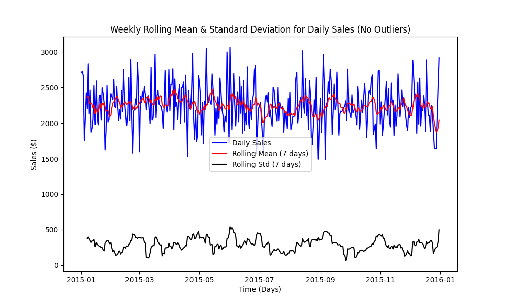

# Forecasting Restaurant Sales

In this project we practice the technique of forecasting sales for a New Jersey based restaurant's sales. The original dataset can be found here: (https://www.kaggle.com/datasets/shilongzhuang/pizza-sales) The analysis has proceeded in three main stages.

1) Data Cleaning. Some notable decisions and challenges here were deciding to aggregate the sales data into daily sales (from individual orders), re-indexing by time, and interpolating sales for the few missing dates out of the year. At the end of this document a new cleaned version of the data is saved to use throughout the rest of the workflow.

2) Exploratory Data Analysis. Here is where most of the exploration and analysis of the data occurred, much of which informed later decisions in the modeling stage. Many visualizations were generated here. We examined the daily sales table as a time series, with rolling mean and standard deviation overlaid (various windows examined), we examined the seasonal decomposition of the daily sales, we examined the autocorrelation and partial autocorrelation functions for the data out to 40 lags, we fit an ordinary least squares regression line to a scatterplot of the data, we ran an augmented dickey-fuller test to statistically test for constant mean, and we ran a Breusch-Pagan test to test for constant variance. In this stage we learned a number of crucial things about our data: there were some enormous outliers which we would remove, there was no trend, the variance was constant across time after losing the outliers, and there was a high degree of seasonality and autocorrelation in seven day windows. 

3) Modeling. Our approach for modeling here was to start simple and increase complexity as is needed. Therefore, we knew we wanted to start with an ARIMA class model to forecast sales, as opposed to something more complex like XGboost, LSTM, or other machine learning algorithms. Using what we had learned from the exploratory data analysis section, we were quite certain of some of the ARIMA model orders: for example no differencing was needed to achieve stationarity and there was a high degree of seasonality in seven day windows. This allowed us to run an automated grid search of parameters with a greatly constrained space to quickly obtain optimal model orders with respect to our chosen error metric (root mean squared error). We also tested model performance on the data with or without outliers, finding that the removal of the seven or so outliers resulted in dramatically decreased error. Lastly, we examined the model's performance against a small variety of naïve forecasting methods for a baseline comparison, and found that the model outperformed all of them, by as much as 20%